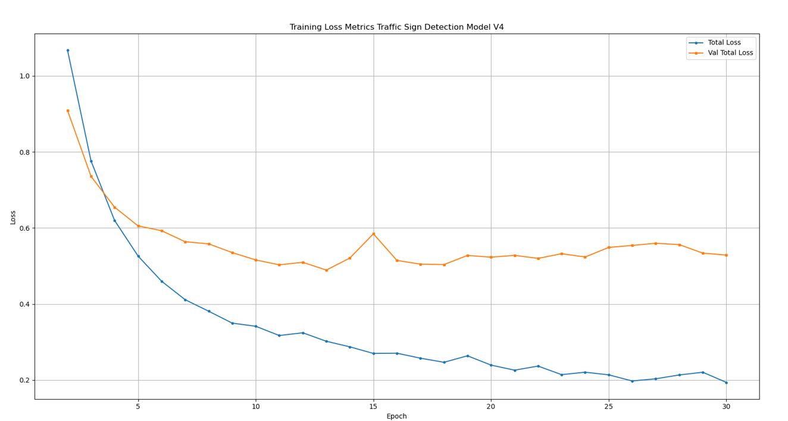

# AI Driver Assistant with Computer Vision Models

This repo contains the scripts used to train a Custom Traffic Sign detection model and trained models.

- Custom dataset ~5000 images
- European (Irish) Road signs
- 29 classes

### Classes

1. 100 km/h 
2. 50 km/h
3. 80 km/h
4. 60 km/h
5. Chevron Left
6. Chevron Right
7. Children Crossing
8. Crossroads
9. Cul-de-sac 
10. Dangerous Bend Ahead
11. Dangerous Bends Ahead
12. Go Left 
13. Keep Left
14. Keep Right
15. No Right Turn
16. No entry
17. No overtaking
18. Pedestrian Crossing
19. Road Narrows
20. Roadworks ahead
21. Roundabout Ahead
22. Side Road on left
23. Side Road on right
24. Speed Ramp Ahead 
25. Staggered Cross Roads
26. Stop
27. T-Junction
28. Two-Way Traffic
29. Yield

## Training Graph

## Sample Images
Sample of results from Android Application [repo](https://github.com/brian-mortimer/aidas_v2)

## Links

- [Roboflow dataset](https://universe.roboflow.com/brian-mortimer-mk3tc/road-traffic-sign-dataset)

- [MediaPipe Framework](https://developers.google.com/mediapipe/framework)

- [Android Project](https://github.com/brian-mortimer/aidas_v2)